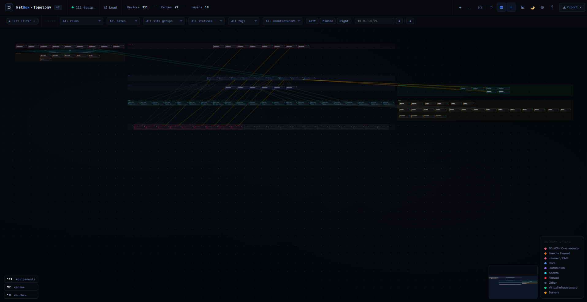

# NetBox Topo Vision

[](https://github.com/Brice97426/netbox-topo-vision/stargazers)
[](LICENSE)
[](https://netbox.dev)
[](https://hub.docker.com/r/briceber/netbox-topo-vision)

> **A standalone, zero-dependency network topology viewer for NetBox — served by a single NGINX container.**


_↑ Interactive SVG topology — dark theme, zone layout, minimap_

---

## ✨ Features

- 🗺️ **Interactive SVG topology** — pan, zoom, click to inspect
- 🏗️ **Multi-column zone layout** — left / center / right columns, fully customizable via the in-browser Zone Editor
- 🔌 **Live NetBox API** — devices, cables, sites, site groups, roles, IP addresses
- 🔍 **Rich filtering** — role, site, site group, status, tag, manufacturer + CIDR/prefix search
- 🔀 **Column toggle** — show/hide individual columns directly from the filter bar
- 💾 **Named filter presets** — save & restore complete filter configurations in one click
- ⬡ **Cable bundle toggle** — group parallel cables into a single labeled edge with count badge
- ☁️ **WAN cloud rendering** — animated cloud node routed between two configurable layers
- 🌐 **Slug-based role matching** — zones matched on NetBox role slugs (case-insensitive substring)
- 🌙 **Dark / Light theme** — persisted in localStorage
- 🗣️ **i18n FR / EN** — auto-detected from browser language
- 📤 **Export PNG ×2 & draw.io XML** — one-click topology export with active filters watermark
- 🗺️ **Minimap** — viewport indicator for large topologies; click to jump
- 🔧 **Zone Editor UI** — add, rename, reorder, recolor zones; import/export JSON
- 🚫 **Role blacklist** — hide unwanted device roles from the topology
- 🔑 **No backend required** — pure static HTML/CSS/JS served by NGINX; API token never reaches the browser

---

## 🚀 Quick Start

### Prerequisites

| Requirement | Version |
|---|---|
| NetBox | 3.x or 4.x |
| Docker & Docker Compose | 20.x+ |
| NetBox API Token | Read-only is sufficient |

### 1. Clone the repository

```bash
git clone https://github.com/Brice97426/netbox-topo-vision.git
cd netbox-topo-vision
```

### 2. Configure environment

```bash
cp .env.example .env
```

Edit `.env` with your NetBox details:

```env
NETBOX_URL=http://192.168.1.100:8000
NETBOX_TOKEN=your_token_here
APP_PORT=8090
```

### 3. Create the default topology file (required on first run)

```bash
echo '{}' > default-topo.json
```

> This file can later be replaced with a custom zone layout exported from the Zone Editor.

### 4. Start the container

```bash
docker-compose up -d
```

### 5. Open your browser

```
http://localhost:8090
```

On first launch, the **Settings modal** opens automatically — your NetBox URL and token are already injected server-side via the NGINX proxy. Click **Load** (or press `R`) to fetch your topology.

---

## ⚙️ Configuration

All user preferences are stored in **browser localStorage** — no source-code edits needed.  
Server-side variables (`NETBOX_URL`, `NETBOX_TOKEN`, `APP_PORT`) are set in `.env`.

| Variable | Default | Description |
|---|---|---|
| `NETBOX_URL` | `http://localhost:8000` | Base URL of your NetBox instance (no trailing slash) |
| `NETBOX_TOKEN` | _(empty)_ | NetBox API token — never sent to the browser |
| `APP_PORT` | `8090` | Host port exposed by NGINX |

### docker-compose.yml (production)

```yaml
services:
  topo-vision:
    image: nginx:alpine
    container_name: topo-vision
    restart: unless-stopped
    ports:
      - "${APP_PORT:-8090}:80"
    volumes:
      - ./index.html:/usr/share/nginx/html/index.html:ro
      - ./favicon.ico:/usr/share/nginx/html/favicon.ico:ro
      - ./css:/usr/share/nginx/html/css:ro
      - ./js:/usr/share/nginx/html/js:ro
      - ./nginx/default.conf:/etc/nginx/templates/default.conf.template:ro
      - ./default-topo.json:/usr/share/nginx/html/default-topo.json:ro
    environment:
      NETBOX_URL: "${NETBOX_URL}"
      NETBOX_TOKEN: "${NETBOX_TOKEN}"
```

### Development (hot reload)

```bash
docker-compose -f docker-compose.yml -f docker-compose.dev.yml up -d
```

Changes to `index.html`, `css/`, and `js/` are reflected immediately — no rebuild needed.

### Using a reverse proxy (production)

The built-in NGINX config already acts as a reverse proxy: all calls to `/api/netbox/*` are forwarded to your NetBox instance with the token injected. No CORS configuration is needed in NetBox.

If you put this container behind an external reverse proxy (Traefik, Caddy…), simply forward HTTP to port 80 of the container.

---

## 🗺️ Zone Configuration

Zones are configured directly in the **Zone Editor** (click ▣ in the topbar).

Each zone has:
- A **key** (stable internal identifier)
- A **label** (displayed in the legend)
- A **color** (zone background, node accent bar, legend dot)
- A list of **slugs** — matched against NetBox role slugs (case-insensitive substring)

Advanced options:
- **Grid layout** — arrange devices in a fixed-column grid within the zone
- **Virtual groups** — group devices into labelled bubbles by name prefix (`sw`, `esx`, `vrtx`, `custom` families)

Export/import zones as JSON to share configurations between instances.  
See [docs/configuration.md](docs/configuration.md) for the complete reference.

---

## ⌨️ Keyboard Shortcuts

| Key | Action |
|-----|--------|
| `R` | Refresh topology |
| `L` | Toggle cable labels |
| `Z` | Toggle zone backgrounds |
| `G` | Toggle cable grouping |
| `+` / `−` | Zoom in / out |
| `Esc` | Close sidebar or modal |
| `?` | Show shortcuts overlay |

---

## 🛣️ Roadmap

- [ ] Drag & drop zones in the editor (live layout preview)
- [ ] Configurable layer slugs from the UI without JSON export
- [ ] Saved filter presets synced to server
- [ ] Toggle cable aggregation per layer
- [ ] localStorage export / import (full config backup)
- [ ] Export zone layout as JSON config

---

## 🤝 Contributing

Contributions are welcome! Please read [CONTRIBUTING.md](.github/CONTRIBUTING.md) first.

```bash
# Fork → Clone → Branch → Commit → PR
git checkout -b feat/my-feature
git commit -m "feat: description"
git push origin feat/my-feature
```

---

## 📄 License

MIT © [Brice97426](https://github.com/Brice97426)  
See [LICENSE](LICENSE) for details.
